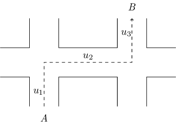
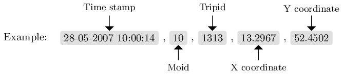
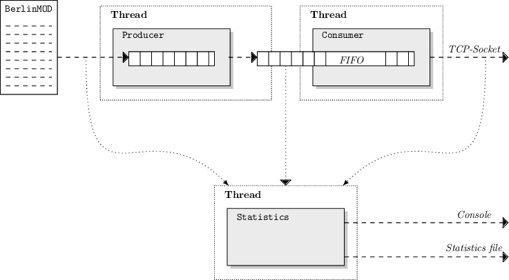
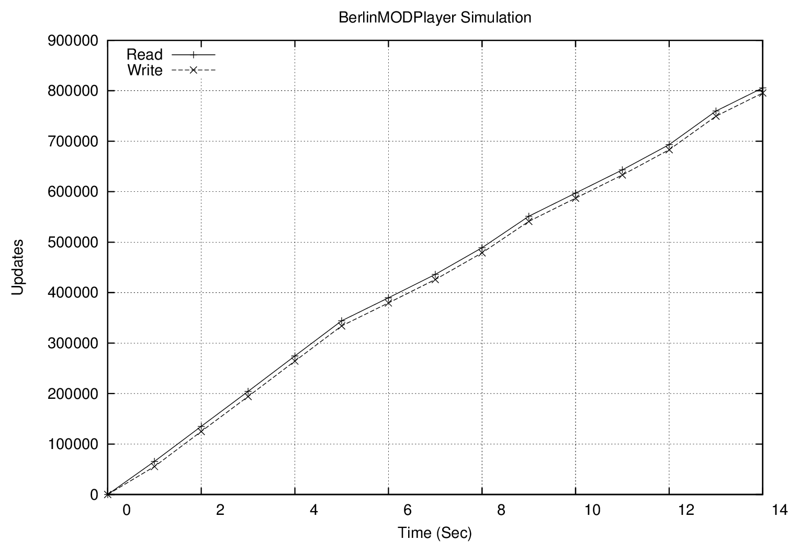
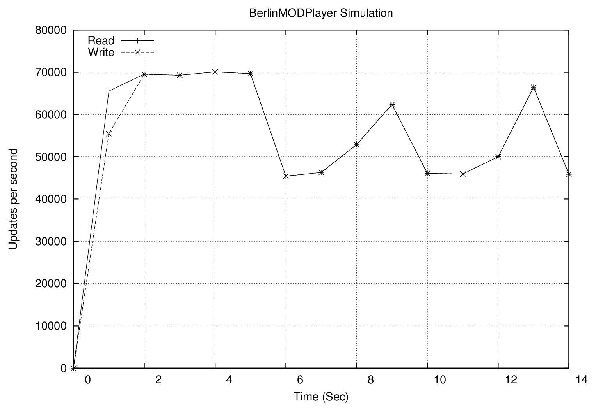

# Abstract
[BerlinMOD](http://dna.fernuni-hagen.de/secondo/BerlinMOD/BerlinMOD.html) is a benchmark for spatio-temporal database management systems. The benchmark generates trips of moving vehicles within Berlin. BerlinMODPlayer is a player for such trips. The Player reads the data generated by BerlinMOD and generates a stream of GPS coordinates therefrom. The stream of GPS coordinates can be used to benchmark stream processing systems.

# Introduction
Stream processing systems are used to process the content of data streams. Such data streams are often generated when moving, or changing objects are observed, and the observation is recorded progressively. For example, the changing price of a stock, the speed of an engine or the position of a vehicle. BerlinMOD is a benchmark that generates trips of moving vehicles within Berlin. BerlinMODPlayer is a software that reads the generated trips and creates a stream of GPS coordinates therefrom. That stream is written to a TCP socket. In a real world scenario, such data stream is generated by a fleet of vehicles moving through the streets of a city and sending their GPS coordinates to a central system.

## Basics
A movement beginning at the coordinate _(xstart, ystart)_ and ending at the coordinate _(xend, yend)_ will be called trip in this paper. A trip is composed of smaller movements, called units (as illustrated in Fig. 1). Trips and units 1 are describing a movement, starting at time t0 and ending at time t1. Inside the interval [t0, t1] the trip is called valid. Outside this time interval, the trip is invalid.



Figure 1: The trip on a map from point A to point B is composed of three units (u1, u2, u3).

## BerlinMod
BerlinMOD is a benchmark for spatio-temporal database management systems. This benchmark includes a generator for moving objects and a set of queries to benchmark the performance of a database management system. In this paper, the data generator is used to create the input data (further called the input file) for BerlinMODPlayer. The basic idea of the data generator of BerlinMOD is to define a set of vehicles and to generate trips on the street network of Berlin. Each vehicle has a HomeNode, representing the holder’s residence and a WorkNode, representing the working place of the holder. Additionally, a set of nodes in the Neighborhood around the HomeNode are used. The data generator creates trips from the HomeNode to the WorkNode and trips to the nodes in the neighborhood. For more details about the creation of trips, see [the BerlinMOD homepage](http://dna.fernuni-hagen.de/secondo/BerlinMOD/BerlinMOD.html). The data generator of BerlinMOD consists of a set of quires for the the extensible database management system [SECONDO](http://dna.fernuni-hagen.de/secondo/).

# BerlinMODPlayer
The following subsections will describe the basic concepts of the BerlinMODPlayer. In addition, the architecture of the software will be discussed. BerlinMODPlayer simulates the movement of vehicles. Consequently, the execution of the software will also referred as _simulation_.

## Command line arguments
The software accepts some arguments, to influence the program behavior and the generated data stream. So, the begin time and the end time of the simulation can be settled, the destination host and port can be specified, to name just a few of the arguments.

| Parameter |        Name       |         Description                 |
|-----------|-------------------|-------------------------------------|
| -i        | Input file        | The file name of the input file.    |
| -u        | Output URL        | The format and the transport for the output. |
| -s        | Simulation mode   | The simulation mode that should be used |
| -o        | Output file       | The output file for the statistics   |
| -b        | Begin time offset | Optional: The time when the simulation should begin. If the parameter is omitted, the simulation begins with the first line of the input file. The time has to be specified in the format: `yyyy-mmm-dd hh:mm:ss` |
| -e        | End time offset   | Optional: The time when the simulation should end. If the parameter is omitted, the simulation ends with the last line of the input file. |

__Example__: Run the BerlinMODPlayer and send the GPS updates to localhost port 10 025 (TCP) in CSV format using the adaptive simulation mode. The statistics are written into the file statistics.txt. The file trips.csv contains
the data generated by BerlinMOD.

    ./bmodplayer -i trips.csv -u tcp://localhost/10025 -s adaptive -o statistics.txt

## Statistics
During the program execution, statistical information of the simulation is written to an output file. This file contains a line for every second of the simulation. Every line consists of five fields: (i) the first field contains the number of seconds passed since the simulation has begun. (ii) The second field contains the amount of read lines from the input file. (iii) The third field contains the amount of written lines on the network socket. (iv) The fourth field contains the amount of read tuples in the last second. (v) The last field contains the amount of sent tuples in the last second.

```
#Sec  Read  Write   Diff read   Diff send
0     0     0       0           0
1     65554 55460   65554       55460
2     135112 124987 69558       69527
[...]
### Total execution time (ms): 11004
### Read: 459974
### Send: 459974
```

The format of the file can easily processed with tools like Gnuplot. The last three lines of the file describe the total execution time of the simulation and the total amount of read and written coordinates.

## The GPS coordinate data stream
BerlinMODPlayer generates a stream of GPS coordinates. The output URL determines the output transport and the output format. Currently, two different output formats and transports are supported: (i) the data can be sent in the CSV format (Comma-separated values) via a TCP socket or (ii) the data can be sent in the JSON format (JavaScript Object Notation) [5] via HTTP requests. Both formats and transports are discussed in the next sections. The next table describes the structure of the supported output URLs.

|       Output URL           | Description        |
|----------------------------|--------------------|
| tcp://myhostname/myport    | Send the output in CSV format via TCP to the host _myhostname_ on port _myport_. |
| http://myhostname/document | Send the output in JSON format via HTTP-Requests to the URL http://myhostname/document. |

### CSV format and TCP output
Every GPS coordinate is represented as a line with five fields: (i) The time stamp when the coordinate is measured, (ii) the object, i.e. the vehicle, who has measured the coordinate, (iii) an id for the trip and (iv) the X and (v) the Y coordinate.



The generated coordinate stream consists of lines in the format described above, ordered by the time stamp of the lines. For example:

```
28-05-2007 10:00:14,10,1313,13.2967,52.4502
28-05-2007 10:00:15,22,3107,13.2178,52.5086
28-05-2007 10:00:15,112,16315,13.2063,52.5424
28-05-2007 10:00:15,6,751,13.322,52.4626
```

After the last coordinate update is send, the ascii _character end of transmission (EOT)_ will be send, to indicate the end of the data stream. Afterwards, the tcp connection will be closed.

### JSON format and HTTP output
Alternatively, the GPS coordinate stream can send via HTTP PUT-Requests. For that kind of output, the GPS coordinates are converted into the JSON format. One coordinate in JSON format looks like:
```
{
    "Id":"100000000000000",
    "Position":{
        "date":"2015-03-06T23:20:01.000",
        "x":13.141600000000002,
        "y":13.141600000000002
    }
}
```

Each coordinate update is send via a single HTTP request to the URL, indicated by the output URL.

## Process the GPS coordinate stream with SECONDO
Secondo contains an operator called csvimport, to import CSV separated data into a relation. This operator can read the data from a file or a network socket. In this paper, the operator is used to import the generated GPS coordinate stream into Secondo. The Operator requires at least three arguments: (i) The data source, (ii) a number of lines to skip and (iii) the used comment character. All lines beginning with the comment character will be skipped. The operator reads each line from the data source and parses the content until the input is processed completely. When the data is read from a file, the end of the input is indicated by reaching the end of the file. When the data is read from a network socket, the end is indicated by the ASCII character EOT.

__Example:__ The following query in Secondo will open a TCP socket on port 10025 and read all the received GPS coordinate updates from the TCP socket. Every coordinate update is converted into a tuple and send to the operator count. After the query finishes, the total amount of received tuples is printed to the console.

```
query [ const rel(tuple([Time: string, Moid: int, Tripid: int, X: real, Y: real])) 
   value() ] csvimport [’tcp://10025’, 0, ""] count;
```

## Architecture
The software was developed with an architectural focus on producing high amounts of GPS updates. BerlinModPlayer is written in C++ and uses the POSIX thread library to create multiple threads and utilize the available hardware as good as possible (see Figure 2). The input data is read by a _Producer Thread_ and placed into a vector. In this vector, the data can be reordered or processed otherwise, depending on the simulation mode.

Occasionally, the content of the vector is moved to a FIFO. A second thread, the _Consumer Thread_, reads the data from the FIFO and writes them to the network socket. The FIFO is the compound between the Producer and the Consumer Thread. Both threads are accessing the FIFO simultaneously. To prevent race conditions, the access to the FIFO needs to be synchronized. Due to the synchronization, only one thread can access the FIFO at the same time. If both threads want to access the FIFO one thread will be blocked and has to wait until the other thread has finished the access. To ensure that both threads can perform their work without wasting much time, the vector mentioned above was introduced. With this vector, the Producer Thread can read data into the memory and placing it into the vector without interfering the consumer thread. Most of the time, the Consumer Thread can access the FIFO exclusively. Only at the moment, when the data from the vector is moved to the FIFO, simultaneous access to the FIFO is needed. A third thread, the _Statistics Thread_, is collecting statistical information about the read and written data and writes it to the console and into a file.



Figure 2: The architecture of the BerlinMODPlayer. The software uses three threads to do tier work: (i) A producer thread, (ii) a consumer thread and (iii) a statistics thread.

## Simulation Modes
BerlinMODPlayer provides currently two different simulation modes: (i) fixed and (ii) adaptive. The simulation mode determines how the trips, generated by BerlinMOD, are handled.

* __Fixed__: This simulation mode reads the units of the trips and sends the begin and the end coordinates of a unit to the TCP socket. The advantages of this mode are the predictable amount of generated GPS coordinates and the exact repeatability of the simulation. The drawback is that the amount of generated coordinates is bound to the read performance of the hard disk because the coordinates need to be read from that device.

* __Adaptive__: This simulation mode simulates the movement of the vehicles in real time. At the beginning of the simulation, the timestamp of the begin of the first unit is kept in memory. Subsequently, this time stamp is updated every second and indicates the current time of the simulation. This mode implements a sweep _line algorithm_ to simulate the movement of the vehicles. The units of the vehicle trips are divided into three groups: (i) dead, (ii) active and (iii) sleeping. The simulation time represents the sweep line. The dead units are behind the sweep line; the active units are crossed by the sweep line and the sleeping units are ahead of the sweep line. According to the simulation time, the active units are loaded into memory and dead units are removed from memory. BerlinMODPlayer calculates and tries to send a position update every second for every active unit. The advance is, that the input data is interpolated in memory. So, the amount of generated coordinate updates is not bound to the performance of the hard disk. The drawback of this mode is, that the amount of generated coordinates is not predictable. So, the simulation can not be repeated exactly.

# Usage
In the next sections, the usage of BerlinMODPlayer is demonstrated. In the first step, BerlinMOD is started to produce the simulation data. In the second step, the produced data is converted and exported into the appropriate file format. In the last step, BerlinMODPlayer is used to run a simulation based on the data.

## Prepare the Simulation with BerlinMOD
A working Secondo installation is required for that step. Information about installing Secondo can be found on the Secondo website. 

__Downloading BerlinMOD__: The followings commands will download and unpack BerlinMOD:
```bash
wget http://dna.fernuni-hagen.de/secondo/BerlinMOD/Scripts_OptimizerCompilant-2015-01-28.zip
unzip Scripts_OptimizerCompilant-2015-01-28.zip
```

Before running BerlinMOD, it is recommended to adjust the variables ```P_NUMCARS``` and ```P_NUMDAYS``` in the file BerlinMOD ```DataGenerator.SEC```. The first one determines how much vehicles should be generated; the second one determines for how many days the data should be generated. For example, the number of days can be set to one, and the number of vehicles can be set to 10000.

Using a high number of vehicles is suggested, especially when using the adaptive simulation mode. Otherwise, the simulation will generate only a few GPS updates every second. Assume, only three vehicles are moving in a particular time frame, the user receive only three GPS updates every second. After adjusting these variables BerlinMOD can be started with the following command:

```bash
SecondoTTYNT -i BerlinMOD_DataGenerator.SEC
```

## Export the generated data
After the last command finishes, the trips are stored in Secondo. These trips have to be exported now. There are two methods to export the data, resulting in different coordinate models. It is possible to (i) export the trips with _Berlin By Bike_ (BBB) coordinates and (ii) export the trips with World Geodetic System 1984 (wgs84) coordinates. Depending on your field of application, chose one of the export commands.

* BBB coordinates:
```
open database berlinmod;
query dataMtrip feed
  project[Moid,Tripid, Trip]
  projectextendstream[Moid, Tripid; Unit : units(.Trip)]
  projectextend [ Moid, Tripid; Tstart : inst(initial(.Unit)),
  Tend : inst(final(.Unit)),
  Xstart : getx(val(initial(.Unit))),
  Ystart : gety(val(initial(.Unit))),
  Xend : getx(val(final(.Unit))),
  Yend : gety(val(final(.Unit))) ]
  sortby[Tstart]
  csvexport[’trips.csv’,FALSE,TRUE] count;
```

* WHG84 coordinates:
```
open database berlinmod;
query dataMtrip feed
  project[Moid,Tripid, Trip]
  projectextendstream[Moid, Tripid; Unit : units(.Trip)]
  projectextend [ Moid, Tripid; Tstart : inst(initial(.Unit)),
  Tend : inst(final(.Unit)),
  Xstart : getx(berlin2wgs(val(initial(.Unit)))),
  Ystart : gety(berlin2wgs(val(initial(.Unit)))),
  Xend : getx(berlin2wgs(val(final(.Unit)))),
  Yend : gety(berlin2wgs(val(final(.Unit)))) ]
  sortby[Tstart]
  csvexport[’trips.csv’,FALSE,TRUE] count;
```

After executing one of the export commands, a file named trips.csv is created in the current directory.

## Run the simulation
Start Secondo and run the following command to open a TCP port 10025, read all produced GPS updates and store them into the relation GPS.

```
let GPS = [ const rel(tuple([Time: string, Moid: int, Tripid: int, X: real, Y: real])) value() ] csvimport [’tcp://10025’, 0, ""] consume;
```

On the command line of the system, execute the following command to run the simulation:
```bash
./bmodplayer -i trips.csv -u tcp://localhost/10025 -s fixed -o statistics.txt -b ’2007-05-28 10:00:14’ -e ’2007-05-28 12:00:14’
```

## Analyze the output file of the simulation
As specified in the command above, the statistics about the simulation are written into the file ```statistics.txt```. BerlinMODPlayer ships with two templates (statistics.plot and statistics diff.plot) for Gnuplot to plot this data.

The first template draws the total amount of read and send lines (the total plot), the second one draws the read and send lines per second (the differential plot). The plot of an example simulation is shown in Picture 3 and Picture 4. The plot of the data can be easily created by copying the gnuplot template and the statistics file into the same directory and running the following commands:

```bash
gnuplot statistics.plot
gnuplot statistics_diff.plot
``` 


Figure 3: The progress of a simulation using the fixed simulation mode. The total amount of read and send lines are shown.


Figure 4: The progress of a simulation using the fixed simulation mode. The amount of read and send lines per second are shown.

After executing the two commands, the four files statistics.gif, statistics.pdf, statistics_diff.gif and statistics_diff.pdf are created. The first two files contain the total plot in the format GIF and PDF. The last two files contain the plot for the differential plot in the same formats.

# Conclusion
In this paper, a load generator for GPS coordinates, called BerlinMODPlayer, was described. BerlinMODPlayer reads trips generated by BerlinMod and generates a stream of GPS coordinates from that data. In a real world scenario, such data can be generated by vehicles, each equipped with a GPS receiver. The player provides two different simulation modes. The simulation mode determines how the input data is handled. The fixed simulation mode uses only the by BerlinMod generated GPS coordinates. The adaptive mode interpolates the movements of the vehicles. Statistical data about the stream is written to a file. This file can be easily analyzed and plotted with Gnuplot.
